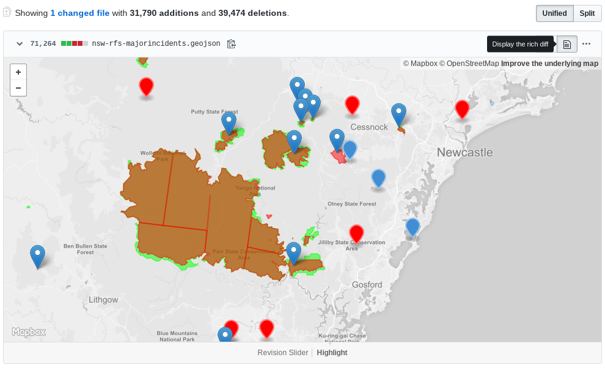

# nsw-rfs-majorincidents-archive

An archive of the 3rd party processed NSW RFS Major Incidents GeoJSON data. Processed using https://github.com/beyondtracks/nsw-rfs-majorincidents-geojson.

_NSW RFS Current Incidents are © State of New South Wales (NSW Rural Fire Service). For current information go to www.rfs.nsw.gov.au. Licensed under the Creative Commons Attribution 4.0 International (CC BY 4.0)._

## GitHub diff

GitHub has a neat GeoJSON comparison tool, to show visual GeoJSON changes. Select the commit you'd like to visualise, then choose "Display rich diff".
